## Conhecendo o Tableau Public com os dados da Olist

Para esse tutorial iremos utilizar o arquivo `base_final_s14_parte2.csv` 
___________________________

Agora que já entendemos as melhores práticas, chegou a hora de conhecermos a ferramenta que iremos utilizar, o Tableau. Em nossa aula, iremos utilizar o Tableau Public Web. E iremos fazer um dashboard com a base que criamos na aula passada da Olist. Vamos lá!

### Conectando os dados
A primeira tela que nos deparamos ao abrir o Tableau Web é a tela de conexão dos dados. Aqui iremos realizar o upload do arquivo `base_final_s14_olist.csv`.

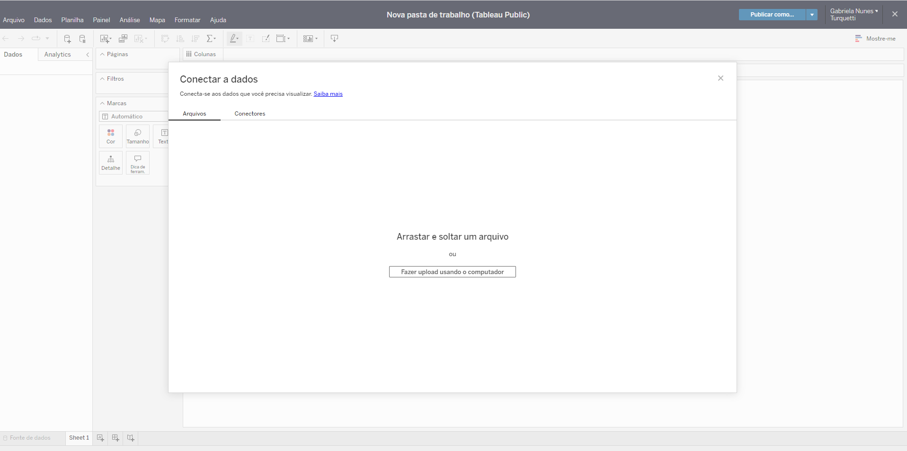

Ao selecionar o arquivo desejado, aguardamos o Tableau processar essas informações:
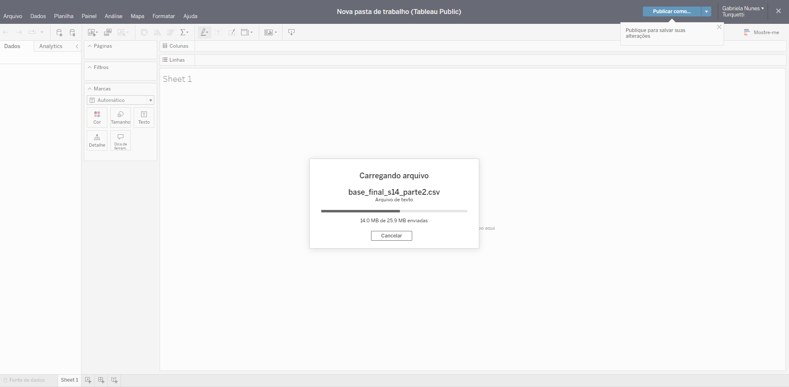

Com o fim do processamento, nos deparamos com a seguinte tela:
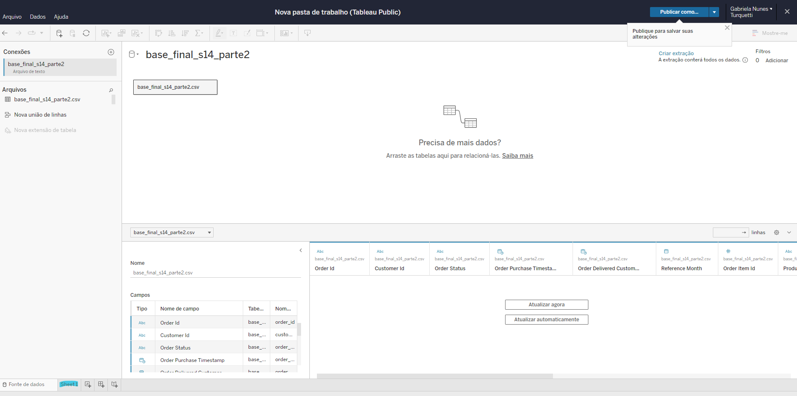

Essa tela nos mostra um 'overview' da tabela que importamos, ela mostra como o nome de cada campo foi renomeado, pode mostrar uma amostra da sua tabela clicando em "atualizar agora", e no canto inferior esquerdo, temos as abas que é onde iremos criar individualmente cada gráfico. 

Vamos para a Sheets 1. 

Iremos ver essa tela sempre que abrirmos uma Planilha (ou sheets) nova. Ao lado esquerdo encontramos todas as colunas da nossa tabela. Logo ao lado temos a label de Marcas que é onde controlamos o tipo de gráfico, e a forma que queremos apresentar nossa informação. 

*O Tableau utiliza uma estrutura de arquivos de pasta e planilha, muito semelhante ao Microsoft Excel. Um workbook (livro de trabalho) contém sheets (planilhas). Uma sheet pode ser uma worksheet (planilha de trabalho), um dashboard (painel de controle) ou uma story (história).*

> ESTRUTURA TABLEAU 
>
> *worksheets < dashboards < story*

 * Uma **worksheet** contém uma única visualização junto com prateleiras, cartões, legendas e os painéis Data e Analytics na sua barra lateral. 

* Um **dashboard** é uma coleção de visualizações de várias worksheets. Os painéis Dashboard e Layout estão disponíveis em sua barra lateral. 

* Uma **story** contém uma sequência de worksheets ou dashboards que trabalham juntos para transmitir informações. Os painéis Story e Layout estão disponíveis em sua barra lateral.
 

### Criando um gráfico de barras
No Tableau, para criar as visualizações, você deve arrastar as colunas ou algum campo das Marcas para o campo de Colunas ou Linhas.

Primeiro arrastamos a coluna de Customer State para o campo de Colunas:

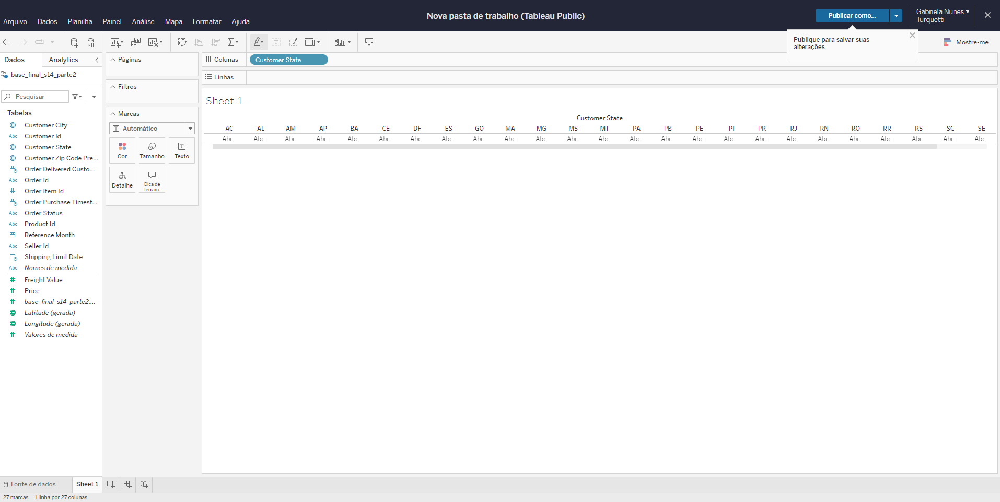

Feito isso, observamos que todos os estados são alinhados na horizontal. Agora, iremos incluir uma dado quantitativo, de preço dos pedidos, para observarmos qual é o estado com mais faturamento.
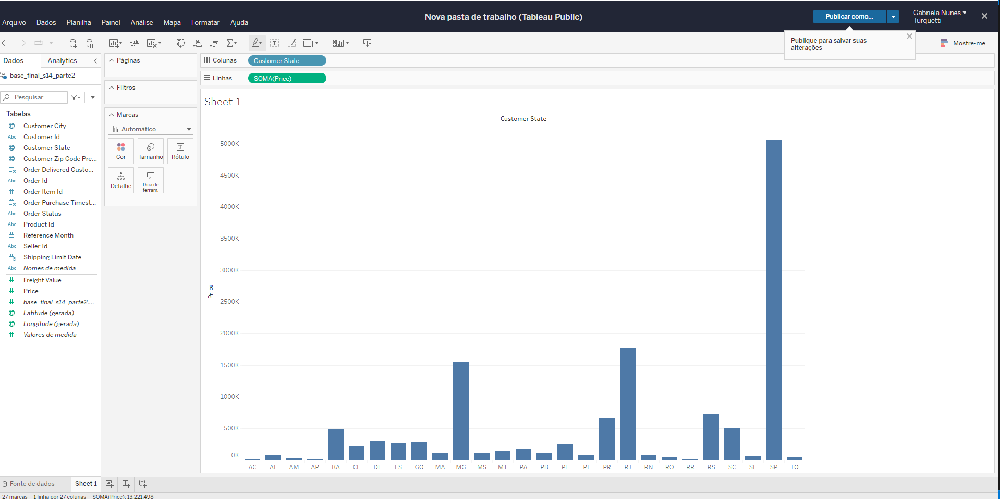

O gráfico de barras é o gráfico padrão do Tableau. Você pode alterar o tipo de gráfico clicando nesse menu dropdown de Marcas:
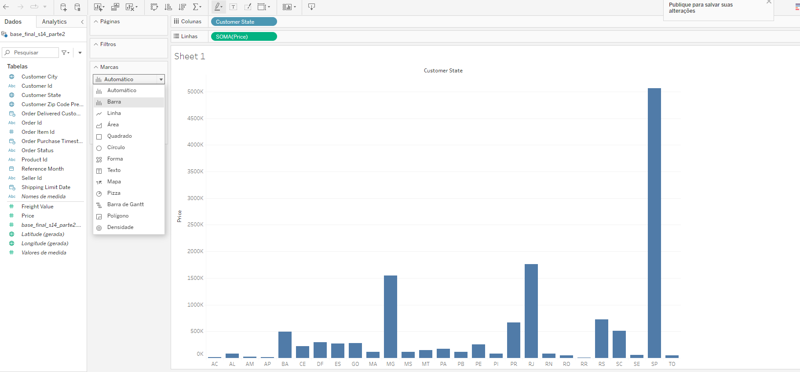

Você pode alterar a cor dessa visualização clicando em Cor, e escolhendo a cor desejada: 
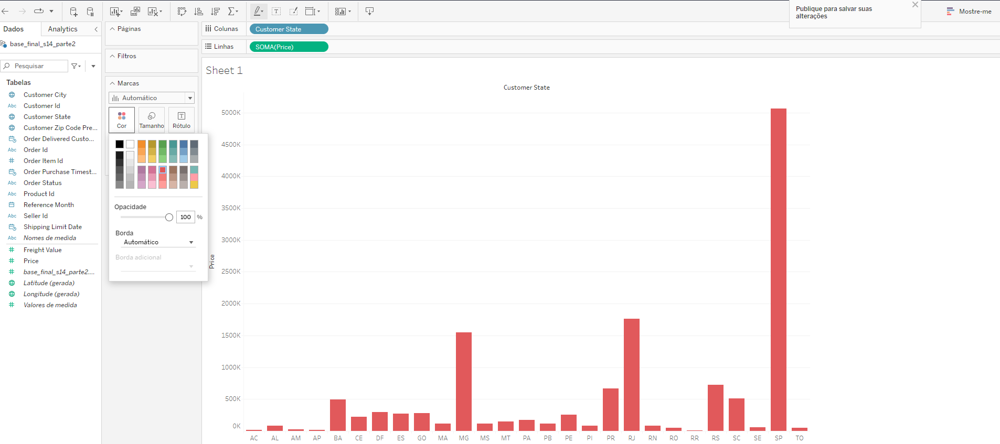

### Refinando nosso gráfico
Agora, vamos ajustar mais um ponto dessa visualização: ordenar os estados por maior valor vendido. São Paulo é bem claro que vendeu mais, mas para estados com vendas relativamente próximas é dificil identificar quem vendeu mais, para isso, vamos ordenar essa informação clicando no eixo de Price:
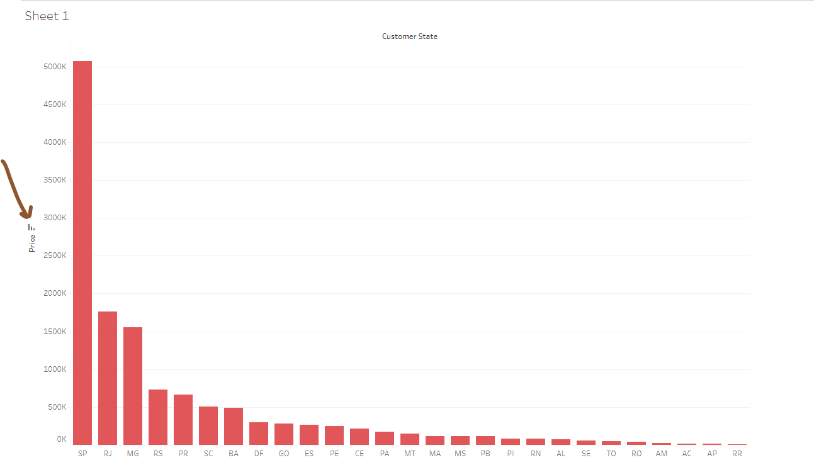

Vamos incluir um título e ocultar alguns eixos.

Clicando duas vezes no texto "Sheet 1" na parte superior do gráfico, iremos escrever:
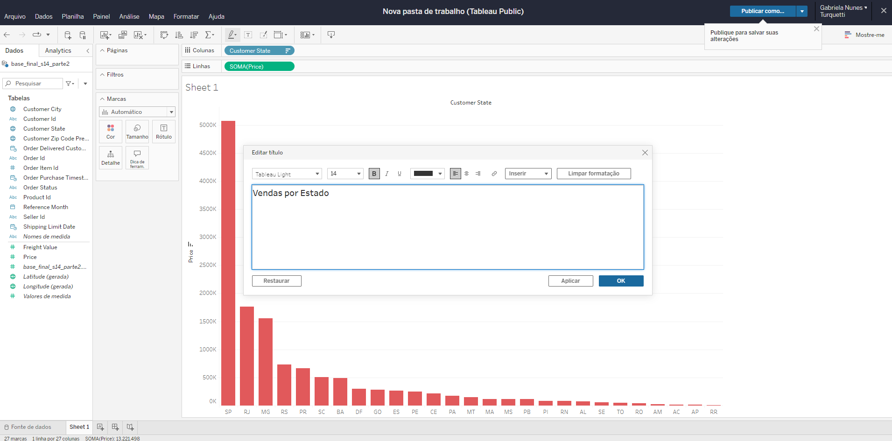

E agora, para deixar a visão mais limpa, iremos ocultar um eixo:
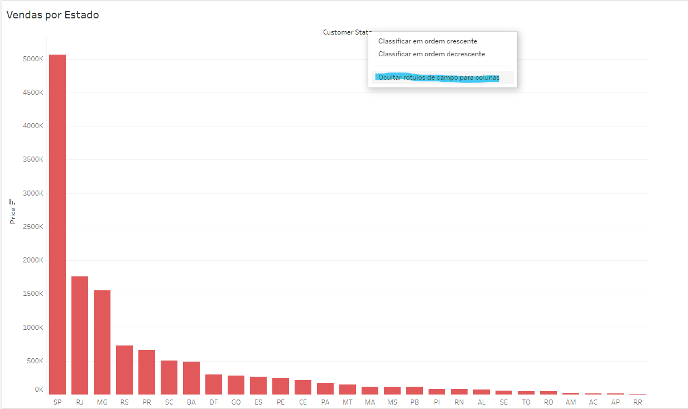

Agora, vamos categorizar essa informação. Quais são as cidades com maior representatividade?

Arrastando a coluna de cidade para Cor, teremos a seguinte visão: 

Passando o mouse, percebemos que para o estado de São Paulo, a cidade de São Paulo é a que trouxe o maior número de vendas. Essa visão é interessante, porém, é um pouco poluída. Vamos pensar numa forma melhor que mostrar essa informação. 

Vamos mudar a paleta de cores para degradê e colocar uma borda no mesmo tom:
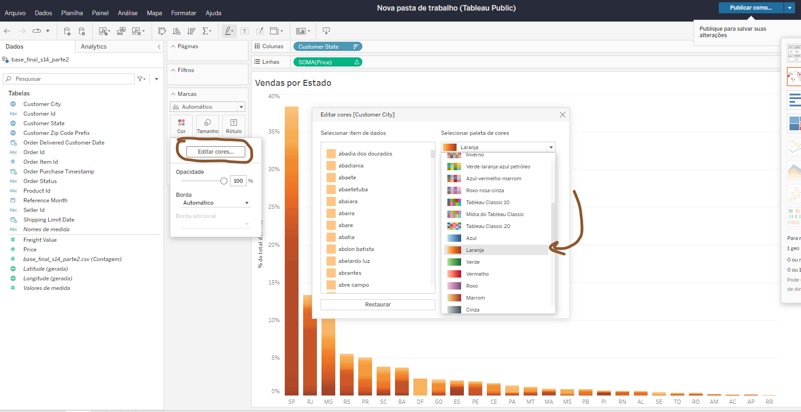

Colocando a borda:
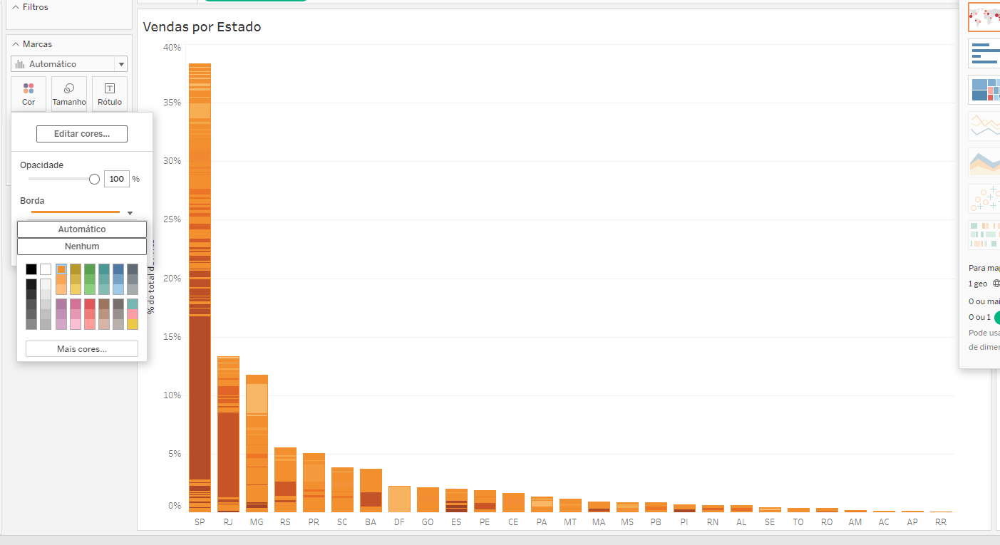

### Incluíndo filtros
Por fim, iremos incluir 3 filtros nessa visualização: de cidade, estado e mês. 

### Gráficos de séries temporais
Para fecharmos essa parte da aula, iremos criar mais um gráfico, agora temporal, para entendermos a sazonalidade do nosso dado: 

⚠️ Quando importamos uma informação de data no Tableau, geralmente ele irá agregá-la por ano. Vamos ajustar esse campo para ele trazer a data da forma que ela está na nossa base: 

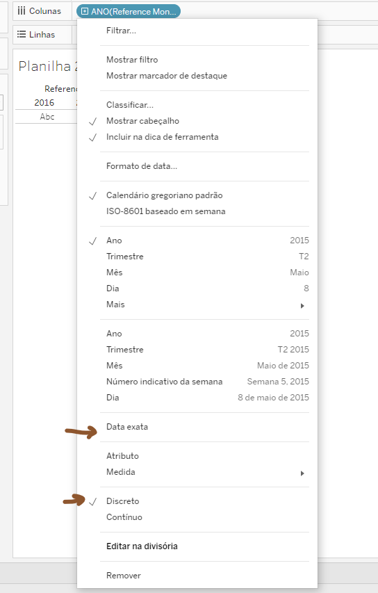

Colocando a coluna Price no campo de Linhas, teremos o seguinte gráfico de evolução: 
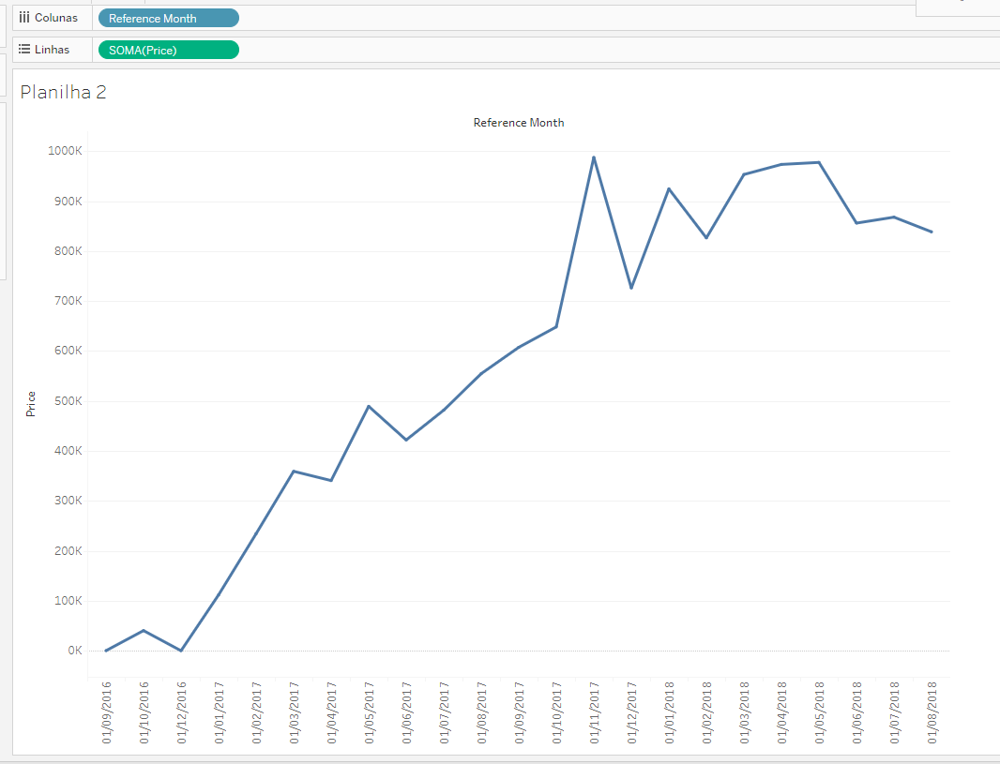

Em filtros, inclua os filtros de reference_month, cidade e estado e aplique esses filtros à todas as planilhas que utilizam essa base:
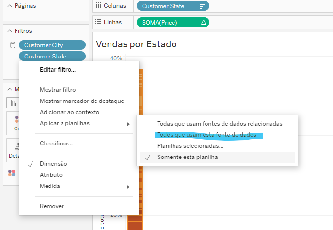

Ah, não esqueça do título também. 

### Montando um dashboard
Agora, vamos colocar essas visualizações em nosso dashboard.

Clicando em Novo Painel, você pode arrastar as visualizações que acabamos de criar:

Agora, vamos deixá-lo interativo com os filtros que trouxemos anteriormente. 

Para fazer isso, no dashboard, clique na setinha da primeira visualização e clique em cada um dos filtros e organize eles no dashboard.

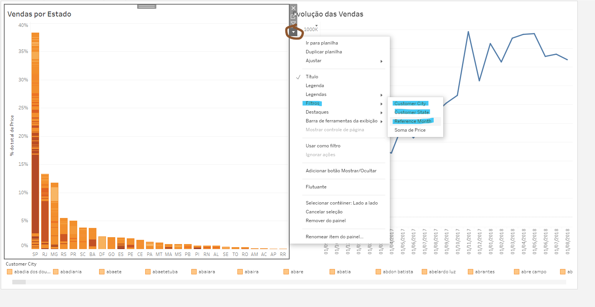

E assim, temos o nosso primeiro dashboard:

## Dinâmica: Importando dados p/ o Tableau e primeiras visualizações

Agora é a sua vez, importe a `base_final_s14_parte2.py` que utilizamos na aula prática, e explore! Importe essa informação para o Tableau, e crie mais algumas visualizações, explore as cores, diferentes tipos de gráficos, e se der tempo, um dashboard com filtros interativos!